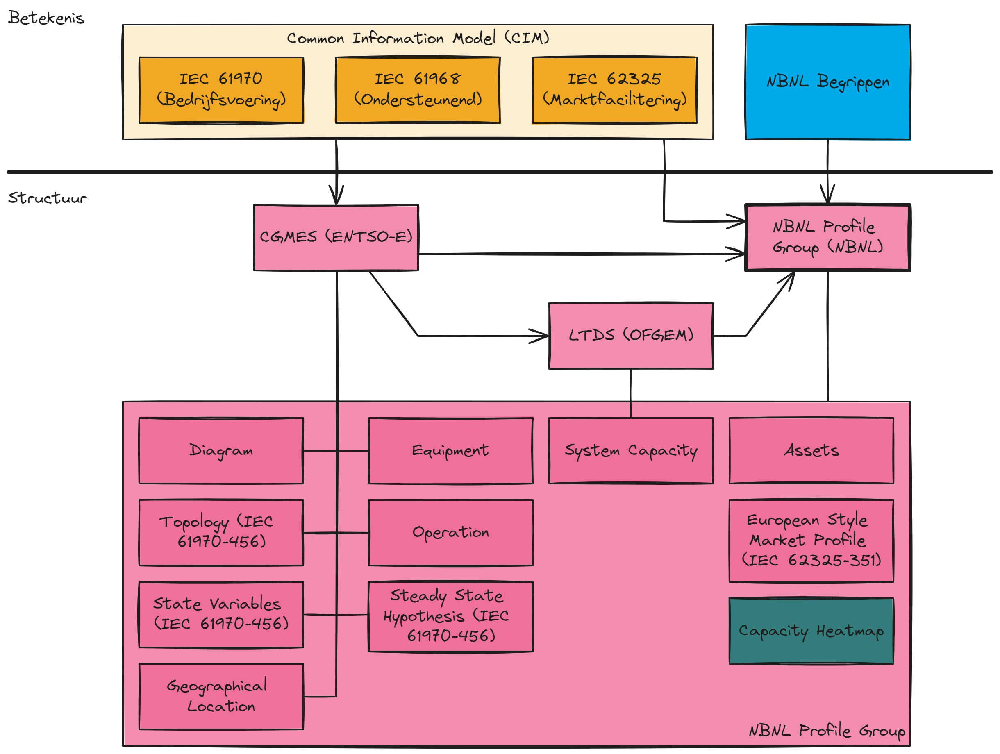

# Inleiding

> TODO

Dit document leunt sterk op doelen en principes beschreven in de *Visie* en
*Doelarchitectuur* Datadelen. Affiniteit aan de kant van de lezer met deze
documenten is niet vereist, maar geeft meer diepgang aan de voorgestelde
oplossing.

# Akkoord

Dit ontwerp is akkoord bevonden door de volgende stakeholders:

- [ ] Werkgroep Semantische Interoperabiliteit (Datum: )
- [ ] Chief Data Officer-overleg (Datum: )

# Executive summary

> TODO

# Achtergrond

Vanuit de CDO's van de netbeheerders van elektriciteitsnetten binnen Nederland
is in 2023 een nieuwe visie rondom datadelen gepubliceerd. Deze visie
beschrijft de ambitie om gestandaardiseerd en herbruikbaar data te delen vanuit
netbeheerders met derden zoals overheden, marktpartijen en klanten.

Ook vanuit Europa staat deze ambitie hoog op de agenda. Momenteel werkt de *EU
DSO Entity* samen met de ENTSO-E aan meerdere *Implementing Regulations* rondom
*demand/response*, *smart metering* en *supplier switching*. Al deze IRs delen
een focus op data en de bijbehorende standaardisatie van het beschrijven en
uitwisselen van deze data.

Om de visie vorm te geven en te implementeren is in 2023 een transitiethema
gestart vanuit Netbeheer Nederland, van waaruit de Werkgroepen
*Doelarchitectuur Datadelen* en *Semantische Interoperabiliteit* invulling
(hebben) gegeven aan de visie. De doelarchitectuur beschrijft een manier van
(meta)data beschrijven en uitwisselen vanuit het perspectief van
*waardestromen* en *dataproducten*, daar waar *Semantische Interoperabiliteit*
zich bezig houdt met de betekenis van data.

## Dataproduct

Voor alle data-uitwisseling binnen de scope van de visie is expliciet gekozen
voor het denken over data in de vorm van dataproducten. Een dataproduct
combineert de semantische-, technische- en gebruiksaspecten van
data-uitwisseling. Om dit invulling te geven bestaat een dataproduct uit de
volgende componenten:

* dataset: de daadwerkelijke gegevens die worden uitgewisseld. Zie een dataset
  als een tabel met gegevens, waarbij de kolommen beschrijven wat er op elke
  rij van de data aan gegevens wordt geleverd. Een dataset voor aansluitingen
  zal minstens een kolom "Aansluitingsnummer" bevatten, waarbij elke rij in de
  dataset een aansluiting beschrijft;
* dataservice: de technische manier van verspreiden van de dataset. Dit gaat
  over hoe de data ontsloten wordt (als bestand, API, database of *file
  server*);
* dataproduct: het combineren van de *dataset* en *dataservice*, verrijkt met
  voorwaarden voor gebruik. Er kunnen o.a. voorwaarden liggen op
  beschikbaarheid, kwaliteit, classificatie en doelbinding bij gebruik van het
  dataproduct.

## Betekenis en structuur

Eén van de grootste vragen rondom data-uitwisseling gaat over de betekenis en
structuur van een dataproduct. Dit vraagstuk raakt primair de *dataset*, waar
elke kolom een specifieke betekenis geeft aan de bijbehorende rijen. De
structuur bepaalt welke kolommen er worden geleverd als onderdeel van de
dataset. Elke informatievraag die één of meerdere dataproducten vereist om op
te lossen moet invulling aan de dataset geven. Ter illustratie: alle lopende
*epics* binnen de pRO voor het maken van dataproducten vereisen een antwoord op
de vraag "welke data is nodig voor mijn dataproduct?"

Gaat het om kleine, op zichzelf staande dataproducten is het bepalen van de
structuur van de dataset triviaal. Gaat het echter om complexere onderwerpen
zoals het modelleren van nettopologie of het modelleren van de functie van het
elektriciteitsnet voor netrekenen wordt de structuur eveneens complexer. Bij
inachtname van de eis op herbruikbaarheid bovenop de voorgenoemde complexiteit
is er behoefte aan een gestandaardiseerde aanpak rondom het beschrijven en
uitwisselen van dataproducten. Dit versnelt de implementatie van nieuwe
dataproducten doordat bestaande dataproducten hergebruikt worden.

De oplossing voor hergebruik en versnelling van de implementatie van
dataproducten is het inzetten van referentiestandaarden. Wereldwijd is de
geldende referentiestandaard voor het vastleggen van de betekenis en structuur
van componenten van een elektriciteitsnet de *IEC/ISO 61970*-standaard, ofwel
het *Common Information Model*: CIM.

## Common Information Model (CIM)

Het Common Information Model (CIM) is een internationaal gestandaardiseerd
model voor gegevensuitwisseling in de energiesector, ontwikkeld door de
*International Electrotechnical Commission* (IEC). Het CIM faciliteert de
interoperabiliteit tussen verschillende energiesystemen en -applicaties door
een uniforme *datataal* te bieden, wat essentieel is voor het efficiënt beheren
van complexe netwerkoperaties en het ondersteunen van de integratie van
hernieuwbare energiebronnen en nieuwe technologieën zoals *smart grids*.

Het CIM bestaat uit drie standaarden met verschillende doelen, die de betekenis
van componenten van het elektriciteitsnet beschrijven:

* *IEC 61970*: bedrijfsvoering & netontwerp;
* *IEC 61968*: ondersteuning van de bedrijfsvoering, zoals asset- en
  werkordermanagement;
* *IEC 62325*: marktfacilitering voor US- en EU-energiemarkten.

Deze drie standaarden beschrijven *klassen* van data zoals *Onderstation*,
*Transformator* en *Kabel*, welke attributen er vastgelegd worden per klasse en
de relaties tussen klassen. Het zijn deze klassen die de betekenis van "dingen"
in de echte wereld uitdrukken voor een specifiek doel.

Daarnaast wordt het [Netbeheer Nederland
Begrippenmodel](https://begrippen.netbeheernederland.nl/) gehanteerd als basis
voor begrippen die al in gebruik zijn binnen de energiesector.

Niet alle klassen zijn altijd nodig voor het invullen van een specifieke
informatievraag. Wanneer alleen een lijst met onderstations nodig is, hoeven er
geen klassen die betrekking hebben met marktfacilitering mee worden genomen.
Deze keuze is het *structureren* van data: bepalen wat de structuur van de data
is die nodig is voor een specifieke informatievraag. Het CIM beschrijft naast
de betekenis van data een proces om tot een specifieke structuur te komen:
*profileren*. Dit proces volgt op hoofdlijnen de volgende stappen:

1. Bepalen wat de informatievraag is, e.g. "welke onderstations zijn er in
   Nederland die onderdeel uitmaken van het elektriciteitsnet?";
2. Bepalen welke klassen uit het CIM passen bij de informatievraag, en welke
   attributen er per klasse nodig zijn. Dit is het daadwerkelijk profileren,
   dus structureren van de data;
3. De klassen onderbrengen in profielen, waarmee een beheersbaar
   informatiemodel wordt gemaakt;

Sommige profielen zijn dermate breed toepasbaar dat deze ook zelf weer een
standaard worden, dan wel als enkel profiel of een verzameling van profielen:
een *Profile Group*. De *Common Grid Model Exchange Standard* (CGMES) is een
voorbeeld van een gestandaardiseerde Profile Group, waarbij de TSO's binnen
Europa de onderliggende profielen gebruiken op operationele informatie over hun
netten met elkaar uit te wisselen.

Samenvattend: het toepassen van het CIM is het vertalen van de betekenis van
componenten van het elektriciteitsnet naar een passende, herbruikbare structuur
voor het invullen van een informatievraag.

# Doelstellingen

Vanuit de visie en doelarchitectuur datadelen zijn meerdere doelen en principes
gedefinieerd rondom het beschikbaar stellen van data. Dit document legt de
nadruk op de invulling van drie van deze doelen:

1. het [FAIR](https://nl.wikipedia.org/wiki/FAIR-principes) beschikbaar stellen
   van data (*Findable*, *Accessible*, *Interoperable*, *Reusable*: FAIR),
   waarbij de nadruk op herbruikbaarheid ligt;
2. het gebruik van dataproducten voor uitwisseling van data;
3. het versnellen van de implementatie van nieuwe dataproducten, en
   herbruikbaarheid van bestaande dataproducten.

Om invulling te geven aan de bovenliggende doelen positioneren we de volgende
oplossing:

1. het opstellen en beheren van een sectorbreed informatiemodel, in de vorm van
   een *CIM Profile Group*. Hierin wordt de structuur van data gerelateerd aan
   bedrijfsvoering, ondersteunend activiteiten en marktfacilitering beschreven.
   De *CIM Profile Group* wordt beheerd door de *Werkgroup Semantische
   Interoperabiliteit*;
2. het uitvoeren van de processen rondom het opstellen en beheren van de CIM
   Profile Group;
3. (ondersteunen bij) het opstellen en beheren van dataproducten op basis van
   de *CIM Profile Group* voor specifieke informatievragen;
4. uitdragen van het nut en de noodzaak van de *CIM Profile Group*;
5. het geven van trainingen rondom het toepassen van de *CIM Profile Group*,
   inclusief het gebruik van ondersteunende tooling.

In het hoofdstuk [Implementatie](#implementatie) wordt de bovenstaande
oplossing inhoudelijk verder uitgewerkt.

# Aanpak

Voor implementatie van de *CIM Profile Group* wordt gekozen voor een specifieke
aanpak. Hierbij worden profielen opgesteld en gepubliceerd voor concrete *use
cases* (dataproducten). Hiermee wordt direct waarde gecreëerd voor
implementerende teams en de toepasbaarheid van de profielen geborgd.

## Stakeholders

Binnen de aanpak worden een aantal stakeholders voorzien die een rol spelen in
de [implementatie](#implementatie) van dit ontwerp:

* *Chief Data Officers*: de CDOs van de bij *Netbeheer Nederland* aangesloten
  netbeheerders. Auteurs van de *Visie Datadelen*. Het CDO-overleg besluit over
  het verder uitbreiden van de taken, verantwoordelijkheden en bevoegdheden van
  de *Werkgroep Semantische Interoperabiliteit* en toetst of de activiteiten
  van de Werkgroep passen binnen de kaders van de visie;
* *Werkgroep Semantische Interoperabiliteit*: voordrager van dit ontwerp;
* *Domeinraden Klant & Markt en Systeem & Infra* (NBNL): geven opdracht voor
  het implementeren van dataproducten op sectorniveau;
* *Netbeheer Nederland Enterprise Architectuur* (NBEA): de
  enterprisearchitecten van de bij *Netbeheer Nederland* aangesloten
  netbeheerders. Auteurs van de *Doelarchitectuur Datadelen*. NBEA toetst of de
  activiteiten van de Werkgroep passen binnen de kaders van de
  doelarchitectuur.

## Fasering

Het opzetten en beheren van de *CIM Profile Group* is een doorlopende
activiteit. Over de tijd heen verschuift de aanpak en verdeling van
verantwoordelijkheden. Naarmate het volwassenheidsniveau groeit kan er worden
opgeschaald en versneld. Er worden drie discrete fasen onderkend:

1. kortetermijn: de eerste drie (3) tot zes (6) maanden vanaf het startmoment;
2. middellangetermijn: zes (6) tot achttien (18) maanden vanaf het startmoment;
3. langetermijn: langer dan achttien (18) maanden na het startmoment.

Voor verdere toelichting, zie de volgende hoofdstukken.

### Kortetermijn

De kortetermijn kent een aantal *mijlpalen* die worden ingevuld:

* het toetsen van de aanpak: de in dit ontwerp beschreven werkwijze wordt
  uitgevoerd op basis van concrete *use cases*, aangeleverd vanuit o.a. de pRO
  en Landelijke Actieprogramma Netcongestie (LAN). Hiervoor worden
  *deliverables* conform hoofdstuk [Implementatie](#implementatie)
  geïmplementeerd. Procesverbeteringen worden vastgelegd en uitgevoerd;
* opschaling *Werkgroep Semantische Interoperabiliteit*: de werkgroep is in
  haar huidige vorm gericht op het beschrijven van de betekenis van informatie.
  In de nieuwe structuur wordt om additionele vaardigheden gevraagd, zoals
  inhoudelijke kennis van het Common Information Model (CIM). Deze kennis is nu
  in beperkte mate aanwezig, maar dient uitgebreid te worden. Advies is om op
  de kortetermijn externe inhuur aan te trekken ter grootte van ~**één** (1)
  FTE;
* eerste focus ligt op het elektriciteitsnet: voor het beschrijven van het
  elektriciteitsnet is een set van internationale standaarden beschikbaar
  (CIM), waarvoor er ook inhuurbare expertise buiten de netbeheerders
  beschikbaar is. Warmte- en gasnet worden op de kortetermijn buiten scope
  geplaatst;

Het resultaat op de kortetermijn is toetsbaar op de volgende punten:

* er is voor minstens twee (2) dataproducten een bruikbare (door netbeheerders
  geaccepteerde) set profielen gepubliceerd door de Werkgroep, onder de eisen
  beschreven in hoofdstuk [Implementatie](#implementatie);
* er is ervaring opgedaan met het CIM, waarbij de Werkgroep, CDOs en NBEA
  evalueren of de uitbreiding in verantwoordelijkheden past binnen de in de
  *Visie* en *Doelarchitectuur* beschreven kaders. De Werkgroep geeft een
  positief of negatief advies, eventueel onder voorwaarden, voor vervolg;
* het CDO-overleg kiest expliciet voor vervolg naar de middellangetermijn.

### Middellangetermijn

Op de middellangetermijn ligt de nadruk op schaal: hoe kan de *Werkgroep
Semantische Interoperabiliteit* op middellange- en langetermijn duurzaam haar
werkzaamheden uitoefenen:

* herpositioneren Werkgroep: de Werkgroep neemt namens *Netbeheer Nederland* en
  de gezamelijke CDOs de rol en titel van *Ontology (for) Energy Design
  Authority* (OEDA). De OEDA neemt een prominente rol in het beschrijven van de
  betekenis en structuur van de data-uitwisseling, waarbij de OEDA het centrale
  punt is. Als onderdeel van de herpositionering stelt de OEDA een OGSM
  (*Objective*, *Goal*, *Strategy*, *Measurement*) op;
* specialisatie van rollen binnen de OEDA: het beschrijven van betekenis en
  structuur zijn twee verschillende activiteiten die haar eigen vaardigheden
  kennen. Er wordt personeel aangetrokken die die een mix van beide
  vaardigheden meebrengen, met een voorkeurcomptentie (*T-shaped*);
* het vastleggen van betekenis wordt verder geprofessionaliseerd: naast het
  begrippenmodel wordt een formele *ontologie* opgesteld;
* inrichten beoordelingstructuur: vanuit het proces wordt expliciet gevraagd om
  het beoordelen van veranderingen in de profielen. Hiervoor is binnen de OEDA
  een groep van experts beschikbaar om op een vaste interval inhoudelijk
  veranderingen goed te keuren voor publicatie;
* scopevergroting: naast het beschrijven van het elektriciteitsnet worden ook
  het warmte- en gasnet onderdeel van de activiteiten. Hiervoor worden nieuwe
  profielen opgesteld op basis van te kiezen referentiestandaarden;
* verdere opschaling in bemensing: om bovenstaande ambitie te bewerkstelligen
  wordt een opschaling van minstens **vijf** (5) tot **tien** (10) FTE
  verwacht. Dit is een mix van personeel vanuit de netbeheerders en externen om
  de verschillende rollen in te vullen, waarbij extern personeel primair wordt
  ingezet voor training en ondersteuning van intern personeel.

Toetsbaar resultaat bestaat uit:

* de geïmplementeerde profielen zijn geschikt (door netbeheerders geaccepteerd)
  voor toepassing van 80% van de dataproducten voor het Landelijke
  Actieprogramma Netcongestie, Lokale Energiesystemen en Charge Point Operator
  EV;
* de *Ontology (for) Energy Design Authority* (OEDA) heeft minstens 80% van de
  *Measures* uit haar OGSM behaald;
* Alle in deze en voorgaande termijn gepubliceerde modellen zijn onderdeel
  gemaakt van de geformaliseerde ontologie;
* de OEDA neemt als inhoudelijk expert deel aan standaardisatie van toegepaste
  standaarden, zoals het CIM. Specifiek voor het CIM houdt dit in dat er
  minstens deel wordt genomen aan één of meerdere *Task Forces* vanuit de [CIM
  User Group](http://cimug.ucaiug.org/).

### Langetermijn

Op de langetermijn is de *Ontology (for) Energy Design Authority* (OEDA)
uitgegroeid tot een duurzaam en breed inzetbaar organisatie-onderdeel rondom
het beschrijven van betekenis en structuur. Via *Continuous Improvement* worden
de processen geëvalueerd en verbeterd, is het OEDA voor netbeheerders en
externe stakeholders een gesprekspartner en uitvoerende instantie. Het OEDA
werkt actief mee aan de standaardisatie en implementatie van de gehanteerde
referentiestandaarden.

Toetsbare resultaten worden volledig vanuit haar eigen OGSM beschreven en
behaald, waarbij dit document geen verdere richtlijnen of kaders stelt.

# Implementatie

De meest effectieve manier om de in de visie gestelde doelen in te vullen is
het hanteren van een informatiemodel voor de energiesector, waarbij voor het
beschrijven van het elektriciteitsnet gebruik wordt gemaakt van het Common
Information Model (CIM). Om de structuur van de data beheersbaar en
herbruikbaar te maken kiezen we voor het perspectief van verschillende
profielen, samengevoegd tot een *CIM Profile Group*.

## Opzet

De meeste informatievragen rondom het elektriciteitsnet draaien rondom
bedrijfsvoering (nettoplogie, congestie en *power flow*), netontwerp
(nettopologie met een temporaal aspect) en marktfacilitering (meterstanden,
flexibiliteit).

### Betekenis

Begrippen worden overgenomen uit en opgevoerd op [Begrippenmodel Netbeheer
Nederland](https://begrippen.netbeheernederland.nl/). Alle begrippen zijn
uniek identificeerbaar op basis van *URI*, waarmee de structuur (onderstaand)
direct refeert naar het corresponderende begrip.

> [!IMPORTANT]
> Dit vereist een URI-strategie voor het eenduidig identificeren van
> entiteiten.

### Structuur: CIM Profile Group

Om invulling te geven aan de informatievragen wordt de volgende structuur voor
de *CIM Profile Group* gehanteerd:

De *CIM Profile Group* is gemodelleerd op twee bestaande *Profile Groups*:

* *Common Grid Model Exchange Standard* (CGMES): De *CIM Profile Group* beheerd
  en verplicht gesteld door de ENTSO-E. CGMES is specifiek voor TSOs
  ontwikkeld, maar is ook inzetbaar voor DSOs. ENTSO-E is de toezichthouder
  voor TSO's binnen de EU;
* *Long Term Development Statement* (LTDS): additionele profielen en extensies
  op bestaande profielen vanuit CGMES. De LTDS is ontwikkeld door *OFGEM*, de
  toezichthouder op de Britse energiemarkt. LTDS heeft o.a. extensies voor
  het beschrijven van capaciteit en congestie en laagspanningsnetten.

Aanvullend worden de profielen *Assets* en *European Style Market Profile*
vanuit het CIM geprofileerd en de *Implementing Regulations* rondom
*Demand/Response* en *Metering* overgenomen, respectievelijk.

Onderstaand een toelichting van de profielen en hun toepasbaarheid:

|Profiel                      |Toelichting|Voorbeeld|
|-----------------------------|-----------|---------|
|Assets                       |Fysieke eigenschappen van componenten in het net|AssetInfo, WireInfo|
|Capacity Heatmap             |Netcomponenten nodig voor een capaciteitskaart|Substation, Line|
|Diagram                      |Tekenen van elektrische diagrammen: Single Line Diagrams (SLD)|Diagram, DiagramObject|
|Equipment                    |Functionele eigenschappen van componenten in het net|Substation, Switch, Breaker|
|European Style Market Profile|Marktfacilitering binnen EU-markten|MarketParticipant, MarketAgreement|
|Operation                    |Operationele meetwaarden|Measurement, Analog, Accumulator|
|State Variables              |Resultaat van loadflow- en kortsluitberekeningen|svStatus, svSwitch|
|Steady State Hypothesis      |Loadflow en kortsluitgegevens|ProtectedSwitch, Jumper|
|System Capacity              |Systeemcapaciteit|ShortCircuitResult, FirmCapacity|
|Topology                     |Nettopologie: node/breaker v.s. bus/branch|TopologicalNode, ReportingGroup|

### Semantische interoperabiliteit

De *CIM Profile Group*, zoals beschreven in het voorgaande hoofdstuk, vult
specifiek de behoefte in rond het structureren van gegevens binnen een
elektriciteitsnet. Om ook concepten uit andere standaarden te kunnen gebruiken
worden een aantal faciliteiten gebruikt:

* de in hoofdstuk [Bestaan](#bestaan) beschreven werkwijze ondersteunt [Linked
  Data](https://nl.wikipedia.org/wiki/Linked_data). Hierbij worden klassen
  beschreven in een profiel gekoppeld aan een concept uit een specfieke
  standaard. Dit kan het *NBility Business Object Model* zijn, maar ook andere
  referentiestandaarden zoals de NEN2660;
* de profielen wordt gepubliceerd vanuit de *Werkgroup Semantische
  Interoperabiliteit*, waarbij de Werkgroep zorg draagt voor koppeling tussen
  de bestaande begrippen binnen de energiesector en de profielen.

### Processen

Het bouwen en beheren van profielen vereist een aantal processen om deze
activiteiten beheersbaar te houden:

|# |Bedrijfsproces       |Beschrijving|
|-:|---------------------|------------|
|1.|Onderhoud het profiel|Modelleeractiviteiten die een minimale hoeveelheid werk vereisen|
|2.|Plan het profiel     |Ophalen van requirements, ontwerpen van het profiel|
|3.|Bouw het profiel     |Datamodelleren en het  beschrijven van de betekenis en structuur|
|4.|Beoordeel het profiel|Goedkeuring van de verandering in het profiel. Vereist voordat het profiel gepubliceerd wordt|

Het proces voor het aanpassen van een profiel start met een concrete vraag
vanuit een stakeholder om betekenis of structuur toe te kennen aan een
informatievraag. Dit wordt beschreven als een *Onderhoudsverzoek*. Voor kleine
aanpassingen wordt het Onderhoudsverzoek uitgevoerd (1) en wordt het
resulterende nieuwe profiel opnieuw beoordeeld (4) voor publicatie.  Voor
grotere aanpassingen worden één of meerdere *Inhoudelijk Expert(s)* betrokken
(2) en wordt de aanpassing uitgevoerd (3). Weer wordt er een beoordeling
uitgevoerd (4) op het nieuwe profiel en wordt het profiel gepubliceerd.
Uitkomst van het proces is een nieuw profiel met daarin de nieuwe betekenis
en/of structuur.

Uitzonderingen in het proces vallen terug op de voorgaande processtap en worden
daar opgelost.

## Bestaan

Om de processen concreet in te vullen worden er keuzes gemaakt over het bestuur
van de *CIM Profile Group* en de technologische ondersteuning:

* de *CIM Profile Group* als geheel wordt beheerd door de *Werkgroep Semantische
  Interoperabiliteit*. Dit houdt in dat:
  * de processen worden uitgevoerd door de Werkgroep;
  * de Werkgroup verantwoordelijk is voor publicatie en ondersteuning bij
    gebruik van de *CIM Profile Group*;
* voor het beschrijven van de profielen wordt [LinkML](https://linkml.io/)
  gebruikt:
  * elk profiel wordt conform het LinkML metamodel beschreven in YAML;
  * elk profiel wordt als *repository* in de [Netbeheer
    Nederland](https://github.com/Netbeheer-Nederland) GitHub organisatie
    ondergebracht;
  * het profiel wordt als online documentatie (HTML) gepubliceerd op
    *https://netbeheer-nederland.github.io*, of op een nader te bepalen
    subdomein onder *netbeheernederland.nl*
* voor versiebeheer op de profielen wordt het versiebeheermechanisme van GitHub
  gebruikt, waarbij wijzigingen als Git Pull Requests worden beheerd en
  goedgekeurd;
* voor elk profiel wordt een conceptueel model (*Entity Relationship Diagram*)
  beschreven als onderdeel van de publicatie van het profiel (HTML pagina met
  diagram en beschrijving). De structuur (*klassen*) verwijzen naar de
  betekenis via broad/narrow mapping;
* het conceptuele model bevat via URI identificeerbare klassen.

## Werking

Bij het toetsen van de werking van dit ontwerp worden naast de in hoofdstuk
[Aanpak](#aanpak) beschreven indicatoren twee additionele punten onderkend:

* in de uitvoer van de processen wordt actief gekeken naar mogelijke
  procesverbetering. Dit houdt in dat er ruimte is voor optimalisatie,
  versnelling en verscherping. Deze *Continuous Improvement* beslaat zowel
  mens, proces en techniek;
* training en ondersteuning is onderdeel van bedrijfsproces 2: *Plan het
  profiel*. Hierbij wordt het beschrijven van functionele eisen gecombineerd
  met training van zowel eigen personeel als stakeholders bij de netbeheerders.
  Ook vragen gesteld vanuit stakeholders worden opgepakt vanuit dit
  bedrijfsproces.

# Begrippen en definities

* *CDO*: Chief Data Officer
* *Common Information Model*: een *canonical data model* voor het beschrijven
  van het elektriciteitsnet
* *Data & informatie*: data zijn gegevens zonder context, informatie voegt
  context toe
* *DSO*: Distribution System Operator, e.g. Stedin
* *ENTSO-E*: vertegenwoordigt Europese TSOs
* *EU DSO Entity*: vertegenwoordigt Europese DSOs
* *FAIR*: principes op gebruik van data
* *Informatiemodel*: beschrijving van de betekenis en structuur van informatie
  en data
* *Informatievraag*: een verzoek tot het beschrijven van de betekenis en
  structuur van een specfieke behoefte rondom informatie
* *Ontologie*: definieert concepten, entiteiten en hun onderlinge relaties
* *pRO*: Programma Regie Orginsatie, een samenwerkingsverband tussen Netbeheer
  Nederland en EDSN
* *TSO*: Transmission System Operator, e.g. TenneT;
